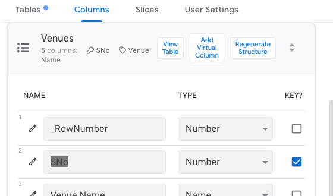

# App Sheet API

- Manage Integrations
- Enable API
- Create Access Key

Supports, Add, Edit, Delete,FIND

https://api.appsheet.com/api/v2/apps/3f71561e-5d2b-4e7c-a6ea-b6795cf48fc8/tables/Venues/Action

* Updates are done using _RowNumber or Using the Specificied Key Column
* 

Columns

